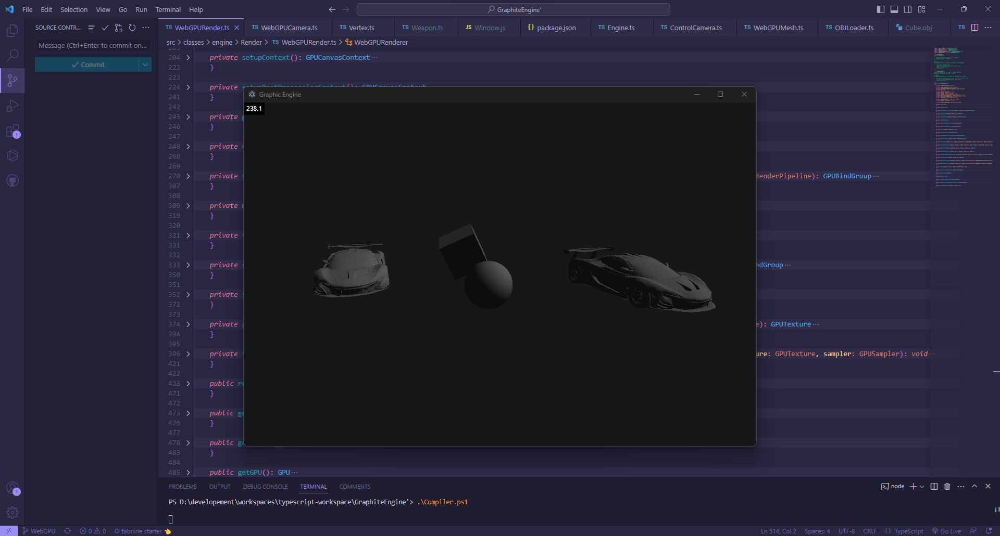

# Graphite
Graphite is a powerfull graphic engine for web applications.

This engine is developped in Typescript and can run in a browser and Electron. The engine is powered by WebGL and no external libraries are required to run the engine.



## How to use
Main.ts
```typescript
export class Main
{
    public static Main(argv: string[])
    {
        let camera = new ControlCamera();
        let cube = new Cube();

        camera.setFov(60);
    }
}

Main.Main([""]);
```

Cube.ts
```typescript
export class Cube extends Actor
{
    public constructor()
    {
        super();

        this.mesh.add(
            new Vector3(-1, -1, -1),
            new Vector3(1, -1, -1),
            new Vector3(1, 1, -1),
            new Vector3(-1, 1, -1),
            new Vector3(-1, 1, 1),
            new Vector3(1, 1, 1),
            new Vector3(1, -1, 1),
            new Vector3(-1, -1, 1),
        );

        this.mesh.setIndices(
            [
                0, 2, 1,
                0, 3, 2,
                2, 3, 4,
                2, 4, 5,
                1, 2, 5,
                1, 5, 6,
                0, 7, 4,
                0, 4, 3,
                5, 4, 7,
                5, 7, 6,
                0, 6, 7,
                0, 1, 6
            ]
        )
    }

    public override update(): void 
    {
        this.transform.getRotation().y += 30.0 * Time.getDeltaTime();
        this.transform.getRotation().x += 30.0 * Time.getDeltaTime();
    }
}
```

This exemple creates a cube.