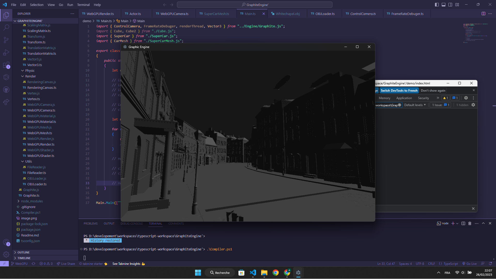

# Graphite
Graphite is a powerfull game engine for web applications.

This engine is developped in Typescript and can run in a browser and Electron. Graphite is powered by WebGPU and requires no external dependencies.

